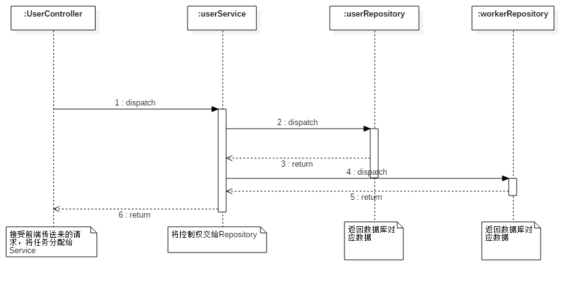
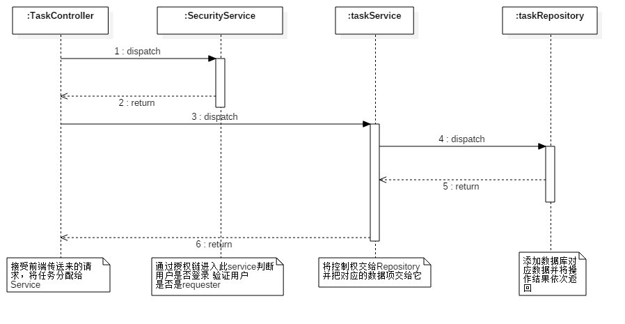
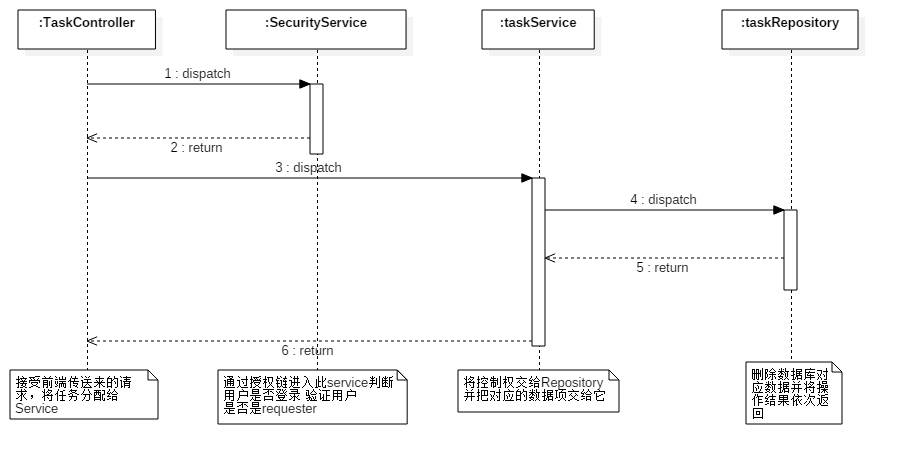
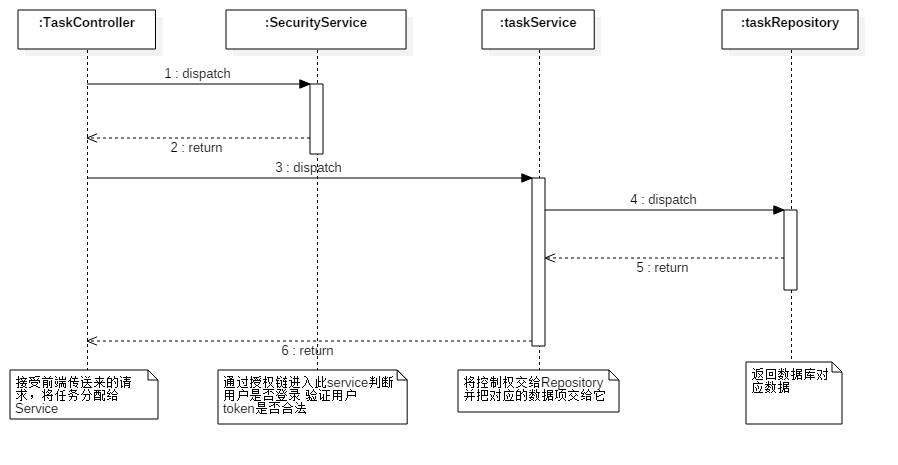
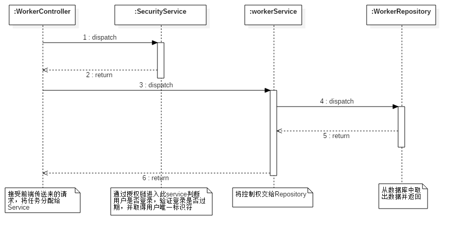
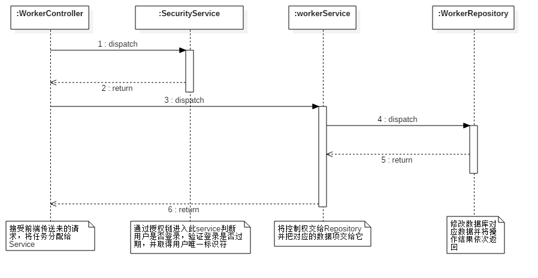
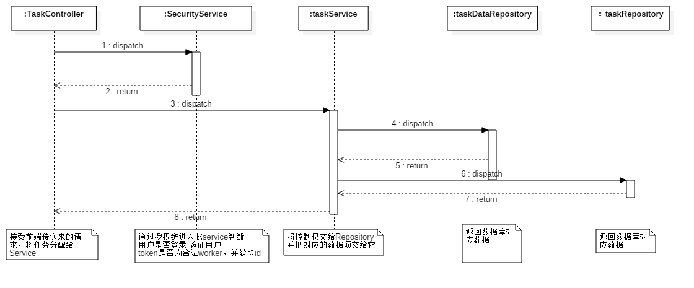
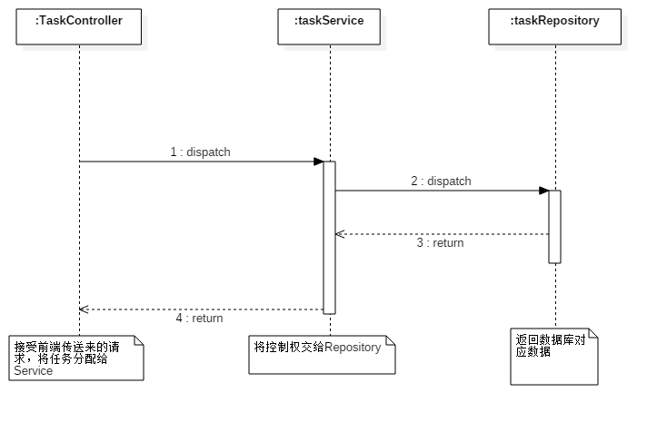
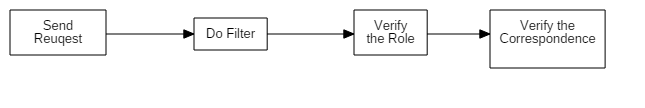
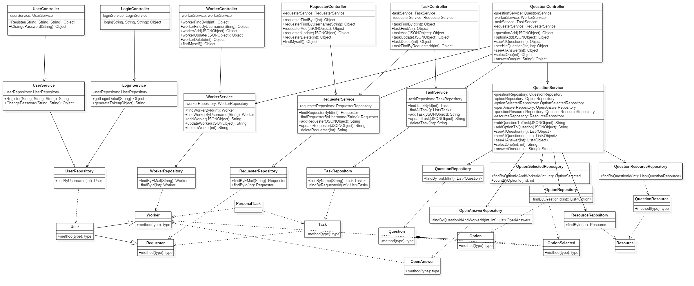

# **Detailed Design**
****

## **Process Flow Design**

The sequence diagram is required, to show the whole process of the system from the entry point to the end point, for each user scenario. Here are our sequence diagram: 

#### **Register(use worker as example)**

When a user send a request to register, service and repository will help to create a new worker and return the result of the action to the user.

#### **Create Task**

When a user send a request to create a new task, the security service will help to make sure that this user is a requester.If everything is ok, service and repository will do the insertion and return the result of the action to the user.

#### **Delete Task**

When a user send a request to delete a task, the security service will help to make sure that this user is a corresponding requester.If everything is ok, service and repository will do the deletion and return the result of the action to the user.

#### **Modify Task**

When a user send a request to modify a task, the security service will help to make sure that this user is a corresponding requester.If everything is ok, service and repository will do the modification and return the result of the action to the user.

#### **View Task Data**

When a user send a request to view the data of a task, the security service will help to make sure that this user is a corresponding requester.If everything is ok, service and repository will return the information to the controller, and finally to the user.

#### **View Task Detailed**

When a user send a requester to view the detailed information of a task, the configuration of security will help us to verify the qualificetion of the user by examing the token. If everything is ok, service and repository will return the information to the controller, and finally to the user.

#### **View Personal Information(use worker as example)**

When a user send a requester to view his or her information, the configuration of security will help us to verify the qualificetion of the user by examing the token. If everything is ok, service and repository will return the information to the controller, and finally to the user.

#### **Update Personal Information(use worker as example)**

When a user send a requester to updata his or her information, the configuration of security will help us to verify the qualificetion of the user by examing the token. If everything is ok, service and repository will do the updating and return the result of the action to the user.

#### **View Personal Task**

When a user send a requester to view the tasks in which he or she get invovled, the configuration of security will help us to verify the qualificetion of the user by examing the token. If everything is ok, service and repository will return the information to the controller, and finally to the user.
#### **Get Task List**

When a user send a requester to view the tasks, service and repository will return the information to the controller, and finally to the user.

****
## **Algorithm Design**

### **Role Authentication**
##### **Background**
In this platform, every user has different accout.Some are workers and some are requesters. Tasks are related to money and the information of users and tasks should be kept in secret, so the security is very important. We use spring security combined with JWT(jason web token).

##### **Algorithm Framework(flowchart of pseudocde)**

##### **Key Steps**
###### **1.Send Request**
The program will first check the request sent from the frontend, and check the SecurityConfiguration to make sure whether the requeste need a token. If it does, enter the next steps.
###### **2. Do Filter**
The program will do the authenticationTokenFilter, it wiil verify that this request is sent with token in its header and make sure it is legal and not out of date.
###### **3.Verify the Role**
Then the spring security will acquire the role of the user, and verify that whether or not this role is able to do this action.

###### **3.Verify the Corresponden**
For example, when a user send a request to update the information of a task, the program will make sure that this user is a requester and he or she is the creator of this task.
****

## **Class Design**

Here is the total class diagram of our project

We use JPA to realize the connection between the backend and the database, so most entity classes’ attribute is as same as database design, and the almost all methods of them are setter or getter or constructor, that’s why we omit them.

